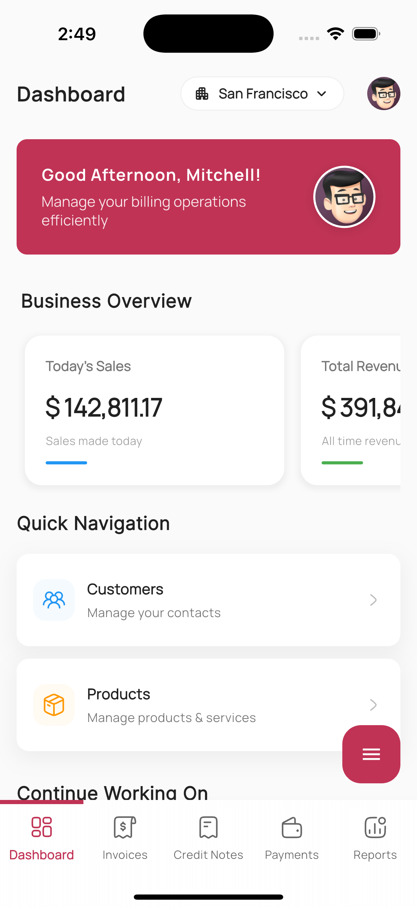
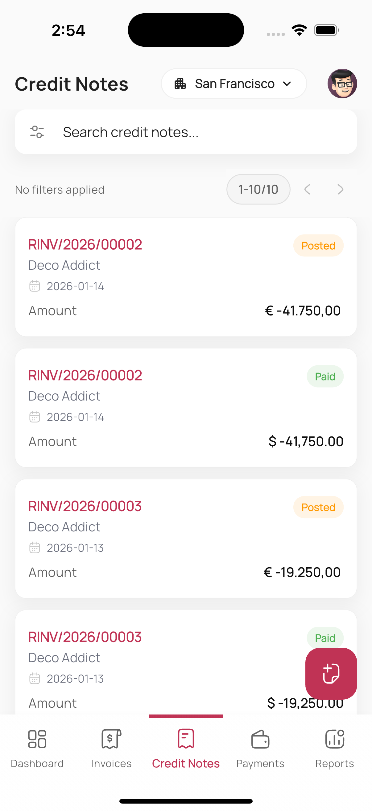
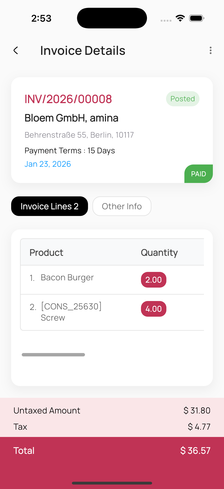
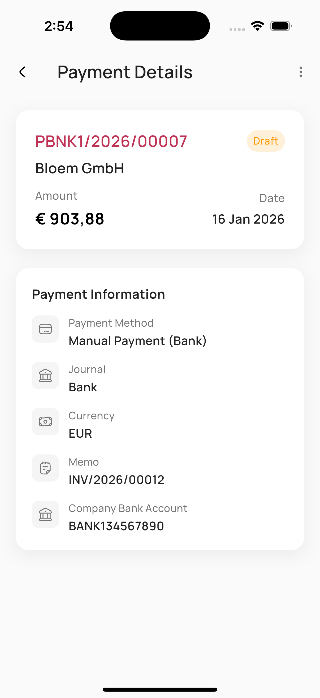

# Mobo Billing for Odoo


Mobo Billing for Odoo is a comprehensive mobile invoicing and billing solution designed to extend Odoo's financial capabilities to Android and iOS devices. Built with Flutter, it empowers businesses to manage invoices, credit notes, and payments with professional precision and real-time backend synchronization.

##  Key Features

###  Billing & Invoicing
- **Invoice Management**: Create, view, and track customer invoices with detail.
- **Credit Notes**: Efficiently manage returns and credits with dedicated credit note workflows.
- **Payment Handling**: Record payments and synchronize transactions directly with Odoo.
- **Professional PDF Reporting**: Generate high-quality PDF invoices and share them instantly.

###  Customer & Financial Insights
- **Financial Dashboard**: Real-time visualization of revenue and billing performance using `fl_chart`.
- **Customer CRM**: Manage detailed customer profiles, histories, and interactive locations.
- **Interactive Maps**: Select and save customer locations using integrated OpenStreetMap support.
- **Multi-Company Support**: Seamlessly operate across different Odoo company profiles.

###  Security & Access
- **Secure Authentication**: Session-based login with database selection and 2FA/TOTP support.
- **Biometric Security**: Quick and secure access via Fingerprint or Face ID.
- **Switch Account**: Effortlessly toggle between different user accounts.
- **Permissions**: Enforce access control synchronized with Odoo user settings.

###  System & Integration
- **Real-Time Sync**: Instant two-way synchronization with your Odoo server.
- **Sharing Capabilities**: Send invoices and receipts via Email, WhatsApp, or other sharing apps.
- **Currency Intelligence**: Automatic handling of multi-currency transactions.
- **Cross-Platform**: Consistent experience across Android and iOS devices.

##  App Demo

<p align="center">
  
  
  
  
</p>

*Visual preview of Mobo Billing's professional invoicing and dashboard interface.*

##  Technology Stack

- **Frontend**: Flutter (Dart)
- **State Management**: Provider
- **Backend Integration**: Odoo RPC (`odoo_rpc`)
- **Document Generation**: PDF Generation from Odoo Reports
- **Mapping**: Flutter Map with OpenStreetMap
- **Graphics**: High-performance charts with `fl_chart`
- **Networking**: `http` with session persistence

##  Platform Support

- **Android**: 5.0 (API level 21) and above
- **iOS**: 12.0 and above

### Permissions
The app may request:
- **Internet Access**: For Odoo server synchronization.
- **Storage**: For PDF storage and temporary report files.
- **Location**: For selecting and saving customer addresses on the map.
- **Camera/Photos**: For customer profile images.

##  Getting Started

### Prerequisites
- [Flutter SDK](https://docs.flutter.dev/get-started/install) (Latest Stable)
- Odoo Instance (Tested Versions: 14 - 19)
- Android Studio / VS Code

### Installation

1. **Clone the repository**
   ```bash
   git clone https://github.com/mobo-open-source/mobo_billing.git
   cd mobo_billing
   ```

2. **Install dependencies**
   ```bash
   flutter pub get
   ```

3. **Run the application**
   ```bash
   flutter run
   ```

##  Configuration
1. **Server Setup**: Enter your Odoo Server URL and Database on the login screen.
2. **Credentials**: Log in with your standard Odoo user credentials.
3. **Company Selection**: Switch between allowed companies from the profile menu.

##  Troubleshooting

- **Connection Error**: Ensure your server URL is correct (use `https://`) and Odoo is accessible.
- **Login Issues**: Verify your database name and ensuring the user has Invoicing permissions in Odoo.
- **Report Errors**: Ensure storage permissions are granted for PDF generation and sharing.

##  Roadmap
- **Excel Export**: Add capability to export financial data to Excel (.xlsx) format.
- **Barcode Scanning**: Implement barcode support for quick invoice and product lookup.
- **Offline Synchronization**: Future support for offline billing and auto-sync.
- **Advanced Tax Configuration**: Enhanced handling for complex regional tax rules.

##  License
See the [LICENSE](LICENSE) file for the main license and [THIRD_PARTY_LICENSES.md](THIRD_PARTY_LICENSES.md) for details on included dependencies and their respective licenses.

##  Maintainers
**Team Mobo at Cybrosys Technologies**
- Email: [mobo@cybrosys.com](mailto:mobo@cybrosys.com)
- Website: [cybrosys.com](https://www.cybrosys.com)
